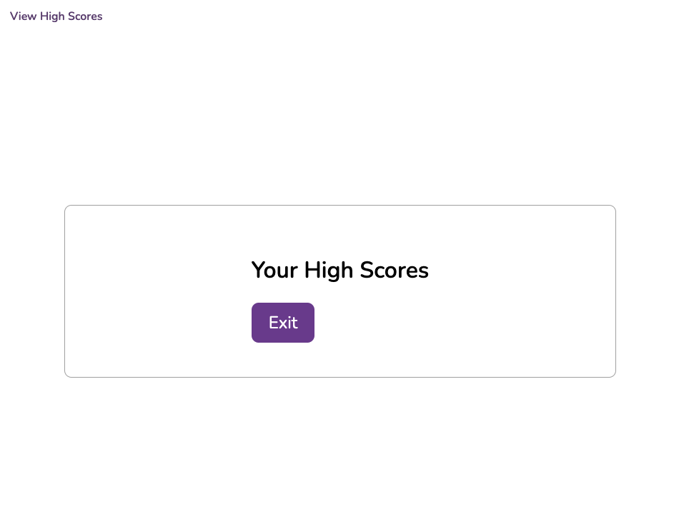
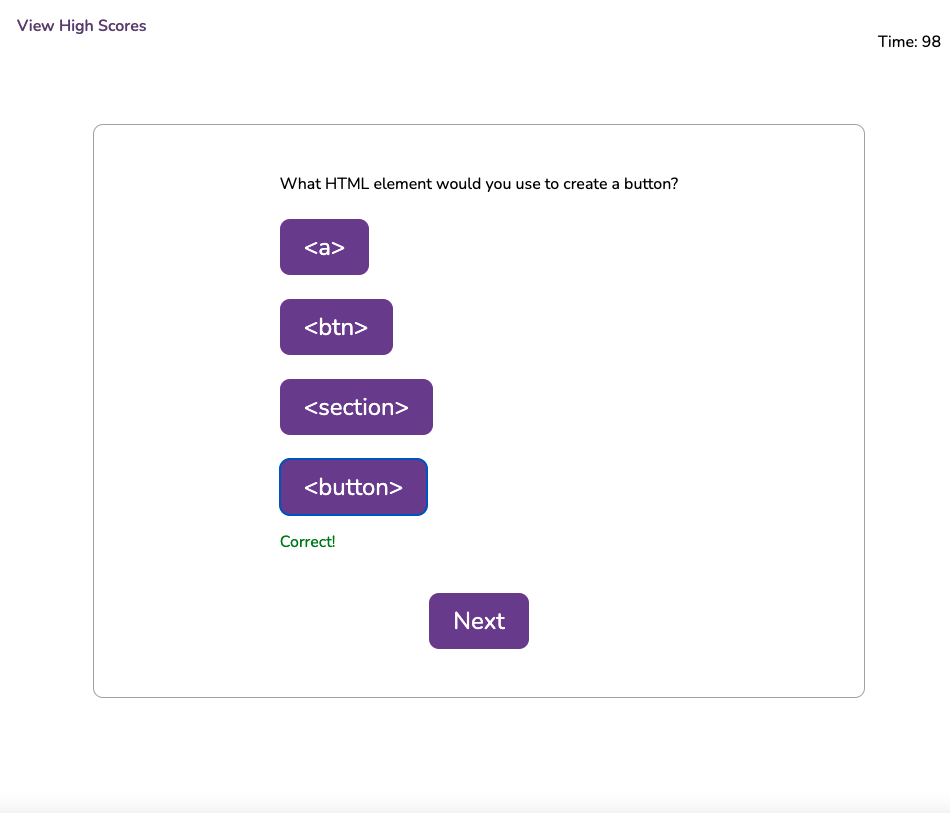
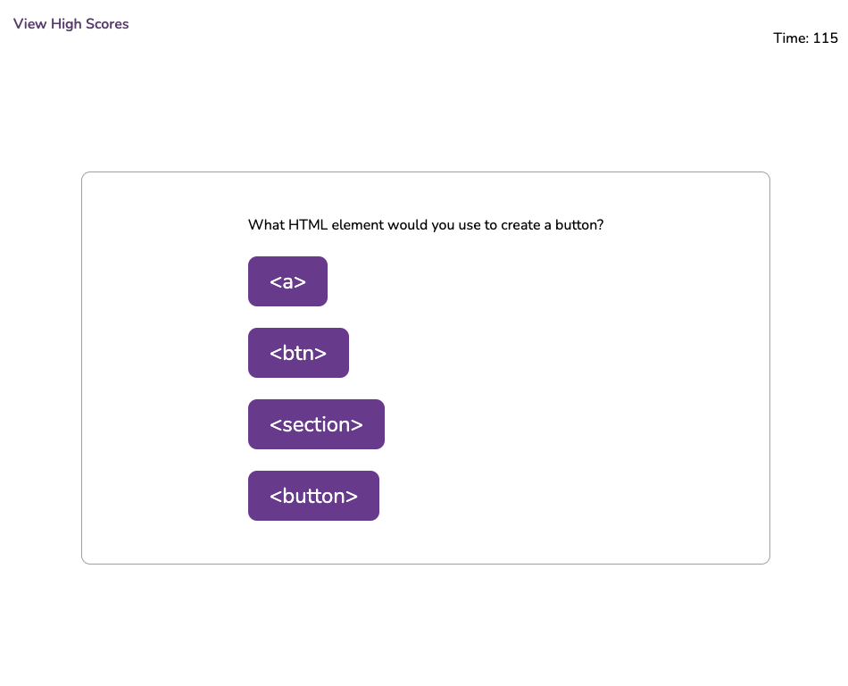
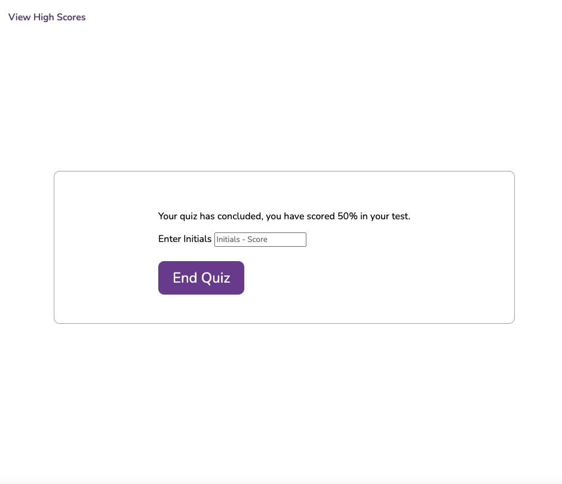
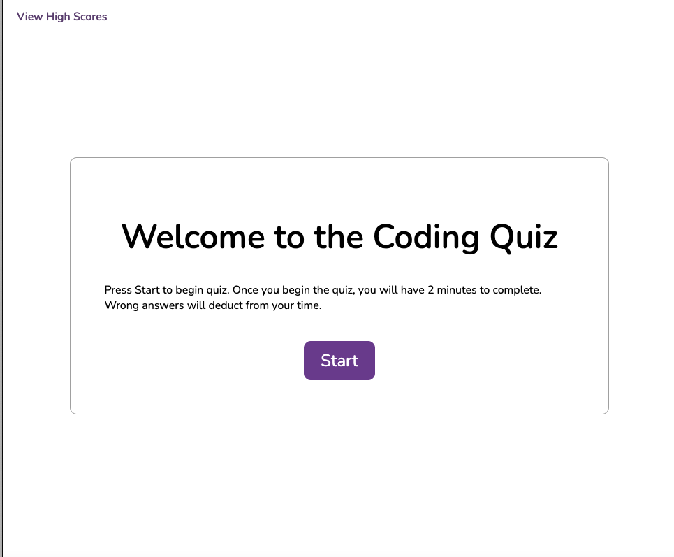

# Coding Quiz

## Feautures
- Interactive Quiz Page with a start page, quiz page, and end page
- 2 minute timer that counts down when you start quiz
- Ability to save your high score to localStorage
- Ability to view your quiz score at the end.

## Screenshot

## Links

- https://jakem8532.github.io/code-quiz/
- https://github.com/jakem8532/code-quiz